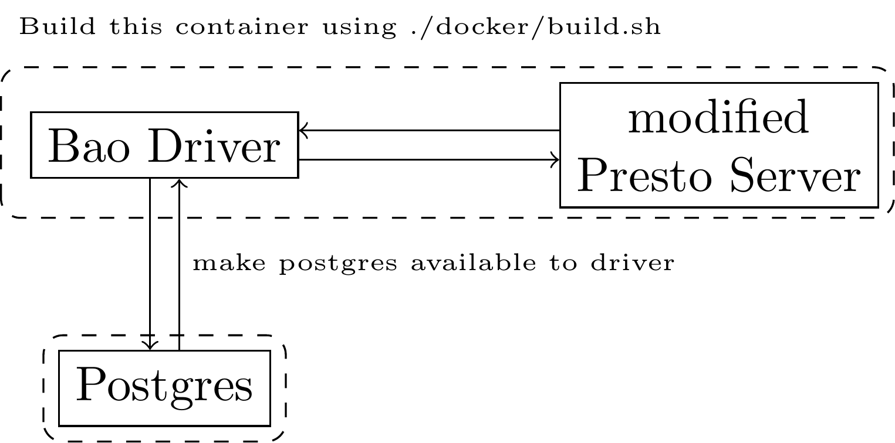

# Bao Integration for Presto

## License

This prototype implementation is licensed mainly under the 'MIT license' (see LICENSE). However, the following files are
licensed under AGPLv3 and are copied and slightly modified from https://github.com/learnedsystems/BaoForPostgreSQL:

- model.py
- net.py
- featurize.py
- storage.py
- train.py

## Requirements

### Modified Presto Server

- Build from source: initialize the git submodules (presto)
- Get release
  from: [Bao-Presto-Integration-Releases](https://github.com/christophanneser/Bao-Presto-Integration/releases)

### Python3 requirements

- Install python requirements using the file `requirements.txt`
- The benchmark driver will persist all data in a postgres database.
- Make the following environment variables available when running `driver.py`:
    - DB_HOST
    - DB_USER (must be owner of DB_SCHEMA to create the tables and functions)
    - DB_PASSWORD
    - DB_NAME
    - DB_SCHEMA

## Run the benchmarks

### Execution

The benchmark execution consists of two steps:

1. Approximate the query span (presto optimizers/rules that actually modify the query plan)
   ```
   driver.py --query_span --benchmark {job,stack,tpch} --catalog {presto catalog} --schema {presto schema}
   ```
2. Running a DP-based approach to find promising optimizer configurations and executing different plan alternatives.
   This will take some time.
   ```
   driver.py --record_time --dot --json --catalog {presto catalog} --schema {presto schema} --repeats 1
   ```
3. By now, the database should be filled with query spans and execution statistics for different plan alternatives.

### Containerization

- For convenience, we added a Dockerfile that sets up all components properly.
- Please, use the `build.sh` script first, then run `docker-compose config` in the `docker` directory.
- You must provide an env variable for the postgres password (cf. `docker/run.sh`).
- Attach to the `bao-presto` container and run the commands shown in the previous section Execution
- You can monitor the submitted queries (including the session variables) by visiting `localhost:8080`



## Code Formatting

- All python files will be checked using `pylint` before they can be comitted. The code style is primarily based on
the [Google Python Style Guide](https://google.github.io/styleguide/pyguide.html), however, it allows much longer
lines (160 characters).
- Please, install and run pylint (there is also a git pre-commit hook) before committing
